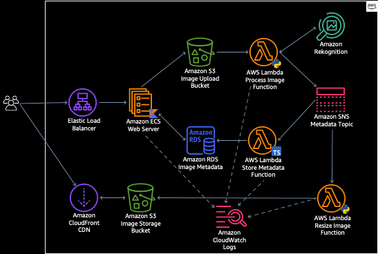

# AWS Toolkits Demo Project

This is a non-trivial (mostly) serverless application to demonstrate the functionality of
the AWS IDE Toolkits on a quasi-real world application.

#### Motivation
A lot of demo applications are extremely simple and don't reflect real world projects that 
are usually complex, with multiple layers, languages and moving pieces. This demo seeks to 
show how the IDE tooling from AWS helps you navigate such complexity in a cloud world.

#### Caveat
This is still a *demo* product - and doesn't necessarily reflect best architectural patterns -
for advice on how to build AWS applications using recommended designs please checkout the
[AWS Well-Architected Framework](https://aws.amazon.com/architecture/well-architected).

## Beer Identification App

Have you ever wanted to be able to systematically analyze images to detect if they contain beer?
Now you can with the "Beer Identification App!" - this is a multi-layered architecture - with an image
processing pipeline and a website for viewing results.

It's made up of several components and the architecture looks something like this:



### Components

To deploy everything, including building from source run the following:

```shell script
./deploy.sh
```

##### Web Server
This is a Containerized [Kotlin-JVM](https://kotlinlang.org/) [Spring Boot](https://spring.io/projects/spring-boot) Web Server that hosts the front-end application for displaying results.
The root of this component is located in the `/web` folder, and has the following requirements to build:

* [Docker](https://www.docker.com/)

<ins>Build</ins>

To build the project run:
```shell script
cd web/
docker build . beer-web-app
``` 

<ins>Run</ins>

To run locally run:
```shell script
docker run -it -p8080:80 \
  --env DB_SECRET=**DB SECRET ARN** \
  --env CDN_DOMAIN=**CLOUD FRONT DOMAIN** \
  beer-web-app
```          

<ins>Deployment</ins>

This component is deployed as an [Amazon ECS Service](https://aws.amazon.com/ecs).
                                                     
##### Image Processor
This is a Python-based [AWS Lambda](https://aws.amazon.com/lambda/) function that listens for events on the Image Upload Bucket, 
calls [Amazon Rekognition](https://aws.amazon.com/rekognition) and publishes the results to a Topic. The
source for this component is in the `/image-processor` folder and requires [Python 3.8](https://www.python.org/downloads/release/python-380/) to run.

##### Image Resizer
This is a Python-based [AWS Lambda](https://aws.amazon.com/lambda/) that resizes raw images from the S3 Image Upload bucket
to create thumbnails and stores the results in the Image Storage bucket.

##### Metadata Storage
This is a TypeScript Node 12 based [AWS Lambda](https://aws.amazon.com/lambda/) that persists image metadata to an
 [Amazon RDS](https://aws.amazon.com/rds/) MySql database. The source for this component is in the `metadata-storage` folder.
 
##### Infrastructure
This is a CDK module that models all of the infrastructure used in this project as a TypeScript project.
To build and deploy this project run:

```shell script
cd infra/
npm install
npm run deploy
```

## Security

See [CONTRIBUTING](CONTRIBUTING.md#security-issue-notifications) for more information.

## License

This library is licensed under the MIT-0 License. See the LICENSE file.